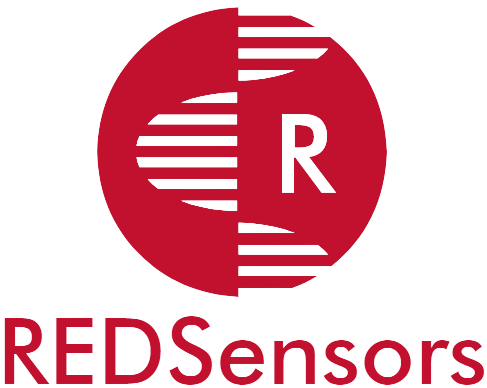

<p align="center">

</p>
<hr>
<h1 align="center">Sistema REDSensors - Frontend Móvil</h1>
<h3 align="center">Desarrollo de Software Avanzado</h3>
<h4 align="center">Máster Universitario en Desarrollo Ágil de Software para la Web</h4>
<h4 align="center">Universidad de Alcalá</h4>
<h5 align="center">Curso 2021-2022</h5>
<h6 align="center" style="font-style: italic">Christian Dopico, David Abarca, Jorge Romero, Justin Hernández, Williams Rodríguez</h6>
<hr>

<!-- ÍNDICE -->

<details open="open">
	<summary>Índice</summary>
	<ol>
		<li>
			<a href="#about-the-project">El proyecto</a>
		</li>
        <li>
			<a href="#about-the-project">Diseño</a>
			<ul>
                <li><a href="#built-with">Stack</a></li>
				<li><a href="#built-with">Arquitectura frontend</a></li>
			</ul>
		</li>
		<li>
			<a href="#getting-started">Como empezar</a>
			<ul>
				<li><a href="#prerequisites">Requisitos previos</a></li>
				<li><a href="#installation">Instalación</a></li>
			</ul>
		</li>
		<li><a href="#license">Licenciamiento</a></li>
		<li><a href="#contact">Contacto</a></li>
	</ol>
</details>

<!-- EL RPOYECTO -->

## El proyecto


<!-- DISEÑO -->
## Diseño

En esta sección se listan las tecnologías, frameworks, librerías y otras herramientas o recursos relevantes usados para la realización del proyecto.

### Stack

#### Tecnologías:

* [Gradle 7.2 (Compilador)](https://gradle.org/)
* [Android 12 (SDK)](https://www.android.com/intl/es_es/android-12/)
* [Java 11 (Embedded JDK)](https://docs.oracle.com/en/java/javase/11/)

#### Otros recursos utilizados en el desarrollo:

* [Android Studio](https://developer.android.com/studio)
* [Git](http://git-scm.com/)
* [GitHub](https://github.com/)
* [Markdown](https://www.markdownguide.org/basic-syntax/)

### Arquitectura frontend

<!-- COMO EMPEZAR -->

## Como empezar

En esta sección se listarán los pasos necesarios para obtener una copia local del proyecto y ejecutarlo en modo desarrollo.

### Requisitos previos

Previamente, debemos tener instalado lo siguiente:

* Un editor de código. Para desarrollo móvil nativo, lo más recomendable es usar el IDE [**Android Studio**](https://developer.android.com/studio)

### Instalación

1. Abrimos un terminal y clonamos el repositorio desde [GitHub](https://github.com/chrisdopico/proyecto-dsa-mobile), vía HTTPS o SSH:

    HTTPS
   ```sh
   git clone git@github.com:chrisdopico/proyecto-dsa-mobile.git
   ```
 	SSH
   ```sh
   git clone https://github.com/chrisdopico/proyecto-dsa-mobile.git
   ```
2. Abrimos el proyecto con Android Studio
3. Ejecutamos la aplicación desde el IDE, teniendo previamente un dispositivo Android compatible conectado, o un emulador

<!-- LICENCIAMIENTO -->

## Licenciamiento

Distribuido bajo la licencia MIT

<!-- CONTACTO -->

## Contacto

Williams Rodríguez: (Desarrollador web) - [williams.rodriguez@edu.uah.es](williams.rodriguez@edu.uah.es)

Justin Hernández (Arquitectura y Backend) - [justin.hernandez@edu.uah.es](justin.hernandez@edu.uah.es)

Jorge Romero (Responsable de proyecto) - [jorge.romeroc@edu.uah.es](mailto:jorge.romeroc@edu.uah.es)

David Abarca (Diseño Bases de datos) - [david.abarca@edu.uah.es](david.abarca@edu.uah.es)

Christian Dopico (Desarrollador móvil Android) - [chrisitian.dopico@edu.uah.es](chrisitian.dopico@edu.uah.es)